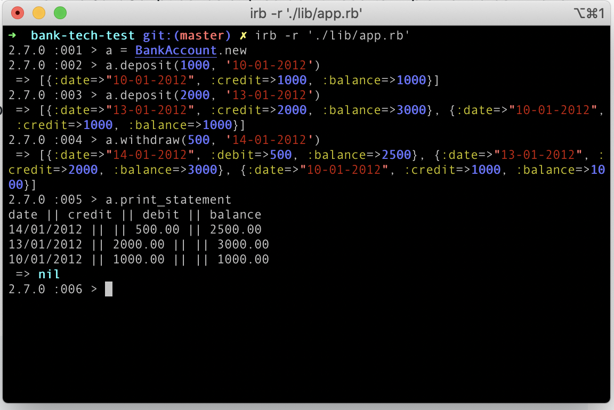

# Bank tech test

## About this app
A bank app where you can make deposits and withdrawals, and see a statement of the transactions with dates and running balance.
You can add the transactions in any order and they will be sorted correctly on your statement.

## My approach
Made using Ruby and RSpec, this is a simple app which does a few minimal checks but mainly assumes the user will input valid information. It takes the date of the transaction with the amount, to account for transactions made before today. 

BankAccount is a class that can be accessed by the user to interact with the account including making deposits and withdrawals and asking for a statement to be printed.

Statement has a class of its own to handle the formatting of the data ready to be printed to the console. 

I think that with some more attention there should be a separate Transaction class and TransactionHistory class. These will handle the storing of the transactions and the balance updates per transaction. 

Currently the BankAccount class does the heavy lifting for checking the input is correct, and updating the balance as each transaction is made - which doesn't quite fit the SRP. 

## How to use
```
irb -r './lib/app.rb'

\\ create a new account
a = BankAccount.new
\\ make a deposit, include how much and when  
a.deposit(1000, '14-01-2020')
\\ make a withdrawal, include how much and when  
a.withdraw(10, '15-01-2020')
\\ print a statement 
a.print_statement
```

It should look similar to this: 


### How to run the tests
```
rspec
rubocop
```

### Test coverage
Test coverage currently at 100%. If you pend the feature tests, the files within lib have 100% coverage, but the feature test files come up as having less - I'm not sure how to cover the tests themselves so have left this as it is. 

Rubocop has 4 offenses that I cannot currently fix. Still working on them.

## Extra specifications
1. 
As a user, I may want to add in a transaction that was missing, 
by passing it with a date in the past (eg. account.deposit(50, '03/08/2020')).
This should in turn readjust my statement so that the transaction shows in the right place, 
and the balances are still correct. 
Does your code currently make this easy to add in? What would need change in your code to make this possible?
/ This feature has now been added

2. 
As a user, I’d like to be able to choose some options for my statement.
If I don’t pass options it’s the default statement (like in the specs).
Here are some options I can choose:
Show dates in american format instead (mm/dd/yyyy instead of dd/mm/yyyy)
Have both debit and credit appear in the same column. Debit show between parentheses. 
The column name is transaction
Right to left -> the order of columns is reversed

Example - If this is the basic statement:
```
date || credit || debit || balance
14/01/2012 || || 500.00 || 2500.00
13/01/2012 || 2000.00 || || 3000.00
10/01/2012 || 1000.00 || || 1000.00
```
this would be the same statement, with all options active:
```
balance || transaction || date
2500.00 || (500.00) || 01/14/2012
3000.00 || 2000.00 || 01/13/2012
1000.00 || 1000.00 || 01/10/2012
```